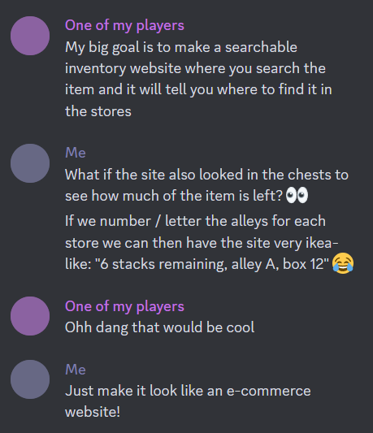

# NBT Apps
A webapp and its support libraries to do cool stuff with Minecraft data in .NET !

## What?


## How to use
* Build the solution
* Copy the `appsettings.json.dist` file to `appsettings.json` (and to `appsettings.Development.json` if needed) and edit the settings in the file to match your Minecraft worlds (check the Configuration section for more info!)

## Configuration
This section describes the important parts of the `appsettings.json` file:

### Map Paths
This section is where you will tell the app where to find your Minecraft server data.
You need to add one entry per world - the property name '`overworld`, `nether`, etc.) is not important for now.
The values need to be the path of the directory that contains the "region" and "entities" folders for the map.

For example, on a Paper server with an Overworld, a Nether, an End, and a custom Creative map:
```
  "MapPaths": {
    "overworld": "/home/minecraft/server/partywoop",
    "nether": "/home/minecraft/server/partywoop_nether/DIM-1",
    "end": "/home/minecraft/server/partywoop_the_end/DIM1",
    "creative": "/home/minecraft/server/creative_map"
  }
```

### Connection strings
This section lets you point the app to the two databases that it needs:
* `NbtDatabase` is the `nbt.db` file that is provided (in `NbtTools/Database`) to power the item search, stack sizes, and correct item names.
* `McMerchantsDatabase` is a database that contains the stores, factories, trading places... that you'll want the website to display!
  * Use the `dotnet ef database update` command to create it at the path you specified in your appsettings file!

An example:
```
  "ConnectionStrings": {
    "NbtDatabase": "Filename=/home/minecraft/mcmerchants/nbt.db",
    "McMerchantsDatabase": "Filename=/home/minecraft/mcmerchants/mcmerchants.db"
  }
```

### Texture Atlas
This section lets you configure the paths for the *texture atlas*, which is used to generate the little icons for the blocks and items.
Start by consulting [this guide](TextureAtlas.md) to create the texture atlas. 
#### Create the texture atlas CSS file
You'll need to put the two files on the server that runs McMerchants,
and reference them in this section of the configuration file.

An example:
```
  "TextureAtlasPaths": {
    "atlas": "/home/minecraft/mcmerchants/texture_atlas/minecraft_textures_atlas_blocks.png_0.png",
    "descriptor": "/home/minecraft/mcmerchants/texture_atlas/minecraft_textures_atlas_blocks.png.txt"
  }
```
#### Replace or regenerate the texture atlas CSS file
Remove these two files:
* `wwwroot/css/atlas.css`
* `wwwroot/img/atlas.png`
Then follow the instructions from the previous section!

## Architecture
Currently contains three projects: 
* `NbtTools`, a class library containing common elements to query NBT data:
  * Villagers and trades
  * Items stored in chests, barrels and shulkers
* `McMerchants`, a webapp that:
  * displays all trades of all villagers in given zones
  * lets you search for an item stored in chests/shulker boxes/barrels in given zones
* `McMerchantsLib`, a class library that carries the underlying concepts of McMerchants, so we can build other apps around them.

## Development
### Entity Framework Core
When executing Entity Framework Core commands, you must set the `project`, `startup-project` and `context` parameters so that:
* `project` points to the project in which files (migrations, ...) must be read and written,
* `context` is the name of the DbContext describing the database to operate on,
* `startup-project` is the name of the project containing a reference to `Microsoft.EntityFrameworkCore.Design` package.

Additionally, in order for the framework to understand how to access the databases, you need to be in the *McMerchants* project directory, and not at the project root (database contexts are initialized from the DI in `Startup.cs`)

For example:
```
cd ./McMerchants
dotnet ef database update --project NbtTools --startup-project McMerchantsLib --context NbtDbContext
```

If the `startup-project` is missing, you will get the following error:
> Your startup project 'NbtTools' doesn't reference Microsoft.EntityFrameworkCore.Design. This package is required for the Entity Framework Core Tools to work. Ensure your startup project is correct, install the package, and try again.

If you are not in the *McMerchants* directory, you will get the following error:
> Unable to create a 'DbContext' of type 'McMerchantsDbContext'. The exception 'Unable to resolve service for type 'Microsoft.EntityFrameworkCore.DbContextOptions`1[McMerchants.Database.McMerchantsDbContext]' while attempting to activate 'McMerchants.Database.McMerchantsDbContext'.' was thrown while attempting to create an instance. For the different patterns supported at design time, see https://go.microsoft.com/fwlink/?linkid=851728